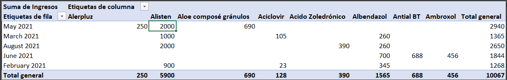

# 🏥 Sistema de Reportes de Medicamentos para Farmacia

## 📖 Descripción
Este proyecto es un caso de estudio ficticio que aborda las dificultades en la gestión de inventarios y ventas en una farmacia. La falta de un sistema informatizado ha generado problemas en el manejo de la información sobre ventas y disponibilidad de productos.

El objetivo principal es implementar un sistema de base de datos que facilite el control y almacenamiento eficiente de medicamentos, mejorando la atención al cliente y la gestión de inventarios.

## 🚨 Problemática
En el año 2021, la farmacia enfrentaba varios desafíos:
- ❌ Dificultades para entender el comportamiento del cliente y procesar ventas.
- 📉 Falta de un sistema que permita analizar y gestionar adecuadamente las ventas de productos.
- 📝 Operaciones manuales susceptibles a errores, afectando la disponibilidad de medicamentos y generando insatisfacción en los clientes.

## ✅ Solución Propuesta
La solución consiste en un sistema de base de datos que permite:
- 📦 Control de entrada y salida de medicamentos.
- 📊 Análisis de datos para identificar los productos más vendidos.
- 🛠 Creación, modificación y depuración de datos para garantizar información confiable.
- 📋 Generación de reportes para mejorar la gestión del inventario y la atención al cliente.

## 📊 Dashboard de Ventas e Inventario
Una de las herramientas clave del proyecto es un **dashboard interactivo** en Excel, que visualiza los datos obtenidos de las consultas SQL. Este tablero proporciona información detallada y representaciones gráficas de las ventas e inventario.

### 🌟 Características del Dashboard:
- 📈 **Gráficos de barras** mostrando los productos más vendidos por mes.
- 📊 **Tablas dinámicas** con datos detallados de ingresos y stock.
- 🔍 **Filtros avanzados** para analizar información por meses y productos.

📸 **Vista del Dashboard:**



📂 **Plantilla del Dashboard**  
Se incluye un archivo de Excel (`plantillas/dashboard_template.xlsx`) que permite visualizar las consultas de ventas e inventario.  
Para utilizarlo, abre el archivo y conecta los datos actualizados desde la base de datos.

## 📌 Consultas SQL Implementadas
Las consultas en `ConsultasFinal-JA.sql` proporcionan información clave sobre las ventas y el inventario:

### 🥇 Ventas de los Productos Más Vendidos (Últimos 12 Meses)
- Identifica los tres productos más vendidos en el último año.
- Permite entender tendencias de compra.

### 📆 Ventas de los Productos Más Vendidos (Año Pasado)
- Similar a la anterior, pero enfocado en el año anterior.
- Ayuda a comparar ventas entre años para mejorar la planificación.

### 💰 Ingresos por Categoría
- Calcula el porcentaje de ingresos generado por la categoría de productos más vendida.
- Facilita la identificación de categorías más rentables.

### 🏆 Producto Más Vendido del Año Pasado
- Proporciona información sobre el producto más vendido del año anterior.
- Permite enfocar esfuerzos en mantener stock adecuado de los productos más demandados.

### 📉 Productos con Menos Stock
- Identifica los tres productos con menor disponibilidad en inventario.
- Ayuda a priorizar reabastecimientos.

### 🚨 Producto con Menos Ventas en el Último Año
- Indica cuál fue el producto menos vendido.
- Brinda información clave para revisar estrategias de marketing y compras.

## ⚙️ Instalación
1. 📥 Clona el repositorio:
   ```bash
   git clone <URL del repositorio>
   ```
2. 📂 Abre el archivo `FarmaciaSP.sql` en tu gestor de base de datos para crear la base de datos.

## 🚀 Uso
- 📌 Ejecuta las consultas en `ConsultasFinal-JA.sql` para interactuar con la base de datos y obtener información relevante sobre las ventas y productos.
- 📊 Abre el dashboard en Excel para analizar los datos visualmente.

---
📧 **Contacto:** Si tienes preguntas o sugerencias, no dudes en comunicarte.

